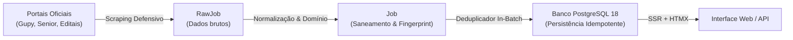

# Radar Enfermagem RS 🏥

> Plataforma web comunitária, cidadã e estritamente **sem fins lucrativos** para monitorar, centralizar e simplificar a busca por vagas de emprego de Técnico em Enfermagem e Enfermagem em Porto Alegre e região metropolitana.

[](LICENSE)
[](https://radarenfermagem.app.br)
[](https://golang.org)
[](https://www.postgresql.org)
[](https://htmx.org)

---

## 🎯 Missão e Impacto Social

O **Radar Enfermagem RS** nasceu de uma necessidade real: profissionais de saúde precisam navegar diariamente por mais de uma dúzia de portais hospitalares distintos (Gupy, Senior, portais próprios de RH, editais públicos) para encontrar vagas de trabalho abertas na sua área de atuação.

Esta plataforma centraliza essas informações em um único catálogo limpo, rápido e acessível, com busca textual e filtros inteligentes:
- **100% Gratuito:** Sem paywalls, sem planos premium e sem taxas para candidatos;
- **Sem Fins Comerciais:** Iniciativa voluntária dedicada à valorização da enfermagem;
- **Transparência:** Redirecionamento direto para a página oficial do hospital para que a candidatura ocorra diretamente na fonte contratante;
- **Respeito à Privacidade:** Não coletamos, não vendemos e não intermediamos dados pessoais de currículos.

---

## 🏥 Instituições Monitoradas

Atualmente, o Radar monitora portais oficiais e processos seletivos públicos das seguintes organizações em Porto Alegre e região metropolitana:

* **Hospital Santa Casa de Porto Alegre** (Gupy)
* **Hospital Moinhos de Vento** (Gupy)
* **Hospital de Clínicas de Porto Alegre — HCPA** (Editais Oficiais / Concursos)
* **Hospital São Lucas da PUCRS** (Gupy)
* **Unimed Porto Alegre** (Gupy)
* **Hospital Mãe de Deus** (Portal Senior)
* **Hospital Divina Providência** (Rede de Saúde Divina)
* **Doctor Clin** (Gupy)
* **Grupo Fleury / Weinmann** (Vagas.com)

---

## 🏛️ Arquitetura & Tecnologias

- **Backend:** Go 1.23+, roteamento com Chi, agendador cron com `robfig/cron/v3`, sincronização com `golang.org/x/sync/errgroup` e rate limiting com `golang.org/x/time/rate`.
- **Banco de Dados:** PostgreSQL 18-alpine com identificadores nativos `UUIDv7`, pool de conexões com `pgx/v5`, queries SQL tipadas via `sqlc` e migrações versionadas com `golang-migrate/v4`.
- **Frontend:** Server-Side Rendering (SSR) com templates em Go e fragments dinâmicos com **HTMX**, CSS utilitário responsivo mobile-first e mínimo JavaScript.
- **Observabilidade:** Logs estruturados em formato JSON (produção) e texto legível (desenvolvimento) com a biblioteca padrão `log/slog`.
- **Infraestrutura:** Docker, Docker Compose e deploy contínuo em VPS com Coolify e Traefik.

---

## 💡 Arquitetura Frontend: Por que existe um arquivo Go (`apps/web/web.go`)?

Uma dúvida comum ao analisar a estrutura de pastas do projeto é: **por que existe código Go dentro do diretório de frontend (`apps/web`)?**

### 1. Monolito de Processo Único (Single Binary)
Embora o projeto adote uma divisão de monorepo (`apps/api` e `apps/web`) para manter responsabilidades bem separadas, em tempo de execução ele **não opera como microsserviços dispersos**. O Radar Enfermagem RS é compilado e executado como um **único binário Go** que roda na porta 8080, servindo a API REST, os fragmentos e telas HTMX e os arquivos estáticos diretamente da memória. Isso elimina overhead de rede, reduz o consumo de memória e simplifica o deploy.

### 2. A Restrição Técnica do `//go:embed`
O Go disponibiliza a diretiva nativa `//go:embed` para embutir arquivos estáticos e templates compilados diretamente no binário executável. Entretanto, o compilador do Go impõe uma regra de segurança estrita: **não é permitido referenciar diretórios superiores utilizando caminhos relativos com `..`** (por exemplo, declarar `//go:embed ../web/templates/*` dentro de `apps/api` resulta em erro fatal de compilação).

Dessa forma, para que os templates HTML (`templates/`) e os arquivos estáticos (`static/`) possam ser embutidos no executável, é obrigatório existir um arquivo Go (`web.go`) no mesmo diretório ou raiz do pacote onde os assets residem.

### 3. Encapsulamento do Frontend como Pacote Go (`package web`)
O diretório `apps/web` é estruturado como um módulo Go independente (`apps/web/go.mod`) e consumido pelo backend via `replace` no `apps/api/go.mod`. O arquivo [`web.go`](apps/web/web.go) atua como o ponto de entrada do subsistema visual, encapsulando:
- **`ViewEngine`:** Responsável por compilar e renderizar os templates HTML (`html/template`) para SSR da página inicial e para os fragmentos dinâmicos do HTMX;
- **`TemplateFuncs`:** Funções utilitárias de renderização de interface (ex.: `timeAgo`, `formatSalary`, `extractSpecialty`, `hasSector`);
- **`StaticFS()`:** Fornece o `http.FileSystem` com os assets embutidos para o `http.FileServer` servir CSS, JS e imagens com cabeçalhos de cache apropriados;
- **View-Models Tipados:** Estruturas como `PageData`, `JobItem`, `CityItem`, `CompanyItem` e `FilterParams`, garantindo tipagem estática e segurança entre os handlers HTTP e a renderização HTML.

Essa arquitetura permite que `apps/api` apenas consuma `web.NewViewEngine()` e `web.StaticFS()`, mantendo os handlers HTTP desacoplados da lógica e sintaxe interna dos templates.

---

## 🔄 Pipeline de Ingestão de Dados (Resumo)

O motor de coleta opera de forma autônoma em segundo plano através de um agendador, garantindo **idempotência**, **resiliência** e **deduplicação lógica dupla**:



1. **Extração Defensiva:** Clientes HTTP com User-Agent identificado, timeouts rigorosos, rate limit por domínio e retentativas exponenciais apenas para erros transitórios (5xx, 429).
2. **Normalização e Validação:** Saneamento textual, inferência geográfica para o RS, mapeamento de vínculos/modalidades e geração determinística de `fingerprint` SHA-256 (`empresa|título|cidade`).
3. **Persistência Idempotente:** Atualização de `last_seen_at` para vagas já existentes e inserção de novos registros, sem duplicatas.
4. **Ciclo de Vida:** Reconciliação automática de status (`ACTIVE` ➡️ `UNKNOWN` ➡️ `EXPIRED`) quando uma vaga deixa de ser vista após determinado período.

> 📖 **Documentação Detalhada:** Para especificações completas de arquitetura, contratos de coletores, rate limiting e testes E2E Live de quebra de layout, consulte o documento dedicado: **[`docs/scraping-pipeline.md`](docs/scraping-pipeline.md)**.

---

## 💻 Como Executar Localmente

### Pré-requisitos
- [Go 1.23+](https://golang.org/)
- [Docker](https://www.docker.com/) e Docker Compose
- `make`

### Passo a Passo

```bash
# 1. Configurar variáveis de ambiente
cp .env.example .env

# 2. Subir o container do banco de dados (PostgreSQL 18)
make up

# 3. Aplicar as migrações versionadas do banco
make migrate-up

# 4. Executar os testes automatizados com detecção de concorrência
make test

# 5. Iniciar a API e a interface web
make run
```
Acesse a aplicação no navegador em: **`http://localhost:8080`**.

### Comandos de Coleta Manual (CLI)

```bash
# Executar coleta ao vivo em modo terminal (dry-run sem alterar banco)
make collect

# Executar coleta e persistir no banco local
cd apps/api && go run ./cmd/collector -query="enfermagem" -persist
```

---

## 🤝 Como Contribuir

Contribuições da comunidade são muito bem-vindas! Se você deseja reportar um bug, sugerir novos hospitais ou enviar código:

1. Consulte o nosso **[Guia de Contribuição (`CONTRIBUTING.md`)](CONTRIBUTING.md)** para conhecer o padrão de branches (Git Flow), convenção de commits e requisitos de testes (TDD).
2. Abra uma [Issue](https://github.com/marcos-vinicius14/radar-enfermagem-rs/issues) descrevendo sua proposta ou correção antes de submeter grandes alterações.

---

## ⚖️ Licença, Isenção de Responsabilidade & Política de Remoção

### Licença de Código-Fonte
O código-fonte do **Radar Enfermagem RS** é distribuído sob a licença **[GNU Affero General Public License v3.0 (AGPLv3)](LICENSE)**. O software é livre e qualquer versão modificada disponibilizada como serviço em rede deve ter seu código-fonte 100% aberto e público sob os mesmos termos, impedindo a apropriação comercial fechada do projeto.

### Isenção de Responsabilidade Legal (Disclaimer)
- O **Radar Enfermagem RS** é um projeto voluntário e cidadão para facilitação de acesso a vagas de emprego públicas.
- O projeto **não possui vínculo institucional, societário, comercial ou de patrocínio** com as instituições de saúde e plataformas de recrutamento citadas.
- Todas as marcas, logotipos, nomes comerciais e dados de vagas mencionados pertencem com exclusividade aos seus respectivos titulares, sendo exibidos unicamente com o propósito de citação e encaminhamento dos interessados aos canais oficiais.
- O Radar **não intermedia candidaturas**, **não recebe currículos** e **não realiza cobranças**. Todas as inscrições ocorrem diretamente nos sites oficiais dos hospitais.

### Política de Remoção de Conteúdo (*Notice and Take-Down*)
Caso você seja o responsável legal ou integrante da equipe de Recursos Humanos de alguma instituição listada e deseje solicitar a atualização, ajuste ou remoção voluntária e imediata das vagas de sua organização deste catálogo público, entre em contato através de:
- **E-mail:** `contato@radarenfermagem.app.br`
- **GitHub:** Abra uma solicitação em nossas [Issues](https://github.com/marcos-vinicius14/radar-enfermagem-rs/issues)

Sua solicitação será atendida prontamente com a máxima prioridade.
