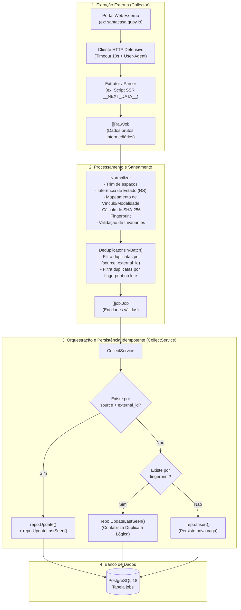

# Fluxo de Scraping e Pipeline de Coleta — Radar Enfermagem RS

Este documento descreve detalhadamente o funcionamento, a arquitetura e as etapas do **Pipeline de Coleta (Scraping)** do **Radar Enfermagem RS**, introduzido na Milestone 3.

---

## 🧭 Visão Geral

O objetivo principal do pipeline de coleta é monitorar portais hospitalares oficiais e agregadores de vagas na Região Metropolitana de Porto Alegre, extrair as oportunidades de Técnico em Enfermagem e Enfermagem, saneá-las e persisti-las de forma **idempotente** e **resiliente**.

O motor é projetado sob quatro princípios de engenharia:
1. **Desacoplamento:** A volatilidade das páginas web externas não afeta as regras de negócio internas.
2. **Idempotência:** Múltiplas coletas consecutivas produzem o mesmo estado estável, sem duplicação de vagas.
3. **Deduplicação Dupla:** Proteção exata por identificador da fonte (`source + external_id`) e proteção lógica por `fingerprint` determinístico SHA-256 (`empresa | título | cidade`).
4. **Detecção de Quebra de Layout:** Monitoramento contínuo da integridade estrutural das fontes com testes E2E Live.

---

## 🏗️ Diagrama de Arquitetura do Fluxo



---

## 🔄 Etapas Detalhadas do Fluxo

### 1. Ingestão e Extração (`Collector` & `RawJob`)

- **Interface do Coletor (`internal/collector/collector.go`):**
  Cada instituição monitorada implementa a interface:
  ```go
  type Collector interface {
      Name() string
      Collect(ctx context.Context, query SearchQuery) ([]RawJob, error)
  }
  ```
- **Coletor de Referência (Santa Casa de Porto Alegre):**
  - Alvo: `https://santacasa.gupy.io`.
  - Localizado em `internal/collector/sources/santacasa.go` (com motor base em `internal/collector/sources/gupy.go`).
  - Mecanismo: Dispara uma requisição HTTP GET defensiva com timeout de 10s e User-Agent identificado.
  - Em vez de realizar scraping frágil por seletores CSS que mudam a cada build de front-end, o coletor extrai a tag `<script id="__NEXT_DATA__" type="application/json">` gerada pelo Next.js (SSR).
  - Deserializa as vagas estruturadas em `props.pageProps.jobs`.
  - Filtra por termos assistenciais/enfermagem quando solicitado em `SearchQuery`.
- **Modelo Intermediário (`RawJob`):**
  - Armazena os dados brutos sem impor constraints rígidas do banco (ex.: strings com espaços soltos, descrições brutas, dados de endereço parciais).
  - Isola as falhas da fonte externa da camada de persistência.

---

### 2. Normalização e Validação de Domínio (`Normalizer`)

Localizado em `internal/collector/normalizer.go`, o normalizador transforma cada `RawJob` em uma entidade de domínio válida `job.Job`:

1. **Saneamento Textual:** Remove quebras de linha e tabulações excessivas e colapsa múltiplos espaços internos em um único espaço (`cleanSpaces`).
2. **Normalização de Localização:**
   - Padroniza o estado para sigla oficial em caixa alta (`"RS"`).
   - Infere automaticamente `"RS"` caso a cidade pertença aos municípios conhecidos da Grande Porto Alegre (ex.: Canoas, Novo Hamburgo, São Leopoldo, Gravataí, etc.).
3. **Padronização de Enums:**
   - **Modalidade (`WorkMode`):** Mapeia termos livres como `"presencial"`, `"on-site"` para `job.WorkModeOnSite`, `"remoto"` para `job.WorkModeRemote` e `"híbrido"` para `job.WorkModeHybrid`.
   - **Tipo de Vínculo (`EmploymentType`):** Mapeia termos como `"efetivo"`, `"clt"`, `"vacancy_type_effective"` para `job.EmploymentTypeFullTime`, `"estágio"` para `job.EmploymentTypeInternship` e `"temporário"` para `job.EmploymentTypeTemporary`.
4. **Cálculo Determinístico do `Fingerprint`:**
   - Aplica normalização NFD Unicode (remove acentos e pontuações) e converte para caixa baixa.
   - Gera um hash SHA-256 de 64 caracteres hexadecimais a partir de `empresa|título|cidade`.
5. **Carimbo Temporal e Status:**
   - Define `Status: job.StatusActive`.
   - Preenche `CollectedAt` e `LastSeenAt` com o timestamp UTC corrente.
6. **Validação de Domínio:**
   - Executa `j.Validate()`. Se faltar algum campo obrigatório (título, empresa, fonte, URL de origem ou fingerprint), retorna erro explicativo em **Português (pt-BR)**.
   - Se um item do lote for inválido, ele é logado como `WARN` e contabilizado como `Failed`, sem cancelar as outras vagas saudáveis do lote (*tolerância a falhas parciais*).

---

### 3. Deduplicação em Lote (`Deduplicator`)

Localizado em `internal/collector/deduplicator.go`, atua antes da gravação em banco para sanear o retorno da fonte:

- **Deduplicação Exata:** Remove registros com a mesma chave composta `source:external_id` retornados repetidamente pela mesma requisição.
- **Deduplicação Lógica:** Se duas vagas do mesmo lote possuírem o mesmo `fingerprint` (mesmo hospital, título idêntico e mesma cidade), apenas o primeiro registro é mantido.
- A quantidade de itens descartados é acumulada no resultado da coleta.

---

### 4. Orquestração e Persistência Idempotente (`CollectService`)

Localizado em `internal/collector/service.go`, coordena o ciclo de vida da vaga no banco PostgreSQL 18:

```
Para cada vaga normalizada:
  1. Busca no banco por `FindBySourceAndExternalID(source, external_id)`:
     - ENCONTROU:
       -> Executa `repo.Update()` com os dados mais recentes.
       -> Executa `repo.UpdateLastSeen(id, now)`.
       -> Incrementa contador `Updated`.
     
     - NÃO ENCONTROU:
       2. Busca no banco por `FindByFingerprint(fingerprint)`:
          - ENCONTROU (duplicata lógica de outro canal):
            -> Executa `repo.UpdateLastSeen(id, now)`.
            -> Incrementa contador `Duplicates` (evita poluir a busca do usuário).
          
          - NÃO ENCONTROU:
            -> Executa `repo.Insert(job)`.
            -> Incrementa contador `Inserted`.
```

Ao final, retorna a métrica consolidada `CollectResult`:
- `TotalFound`: total de vagas retornadas pela fonte
- `Normalized`: total de vagas válidas após saneamento
- `Inserted`: novas vagas adicionadas ao banco
- `Updated`: vagas já cadastradas que tiveram informações atualizadas
- `Duplicates`: vagas idênticas descartadas ou correlacionadas
- `Failed`: registros que falharam na validação de domínio
- `Duration`: tempo total de execução

---

## 🛡️ Detecção de Quebra de Layout (E2E Live Tests)

Web scraping pode se tornar frágil se a estrutura do site mudar sem aviso. Para garantir confiabilidade contínua, o projeto utiliza uma estratégia em duas camadas:

| Camada | Escopo | Execução | Objetivo |
| :--- | :--- | :--- | :--- |
| **Unitários com Fixtures** | Offline | `make test` | Rápido, determinístico, sem depender de conexão externa; roda em todo PR e commit. |
| **E2E Live Contract Tests** | Online | `make test-e2e` | Dispara chamada real contra o portal oficial (`santacasa.gupy.io`) e valida se o layout, scripts e dados continuam compatíveis. |

Se o portal da Santa Casa atualizar sua arquitetura ou remover a tag `__NEXT_DATA__`, o teste `make test-e2e` falha imediatamente com um erro descritivo em português, permitindo correção antes de impactar a produção.

---

## 💻 Como Executar e Validar Manualmente

### 1. Coleta ao vivo formatada no terminal (Dry-Run)
Não altera o banco de dados; apenas extrai do portal externo e exibe as vagas formatadas:
```bash
make collect
```

### 2. Coleta ao vivo com saída em JSON (ótimo para `jq`)
```bash
make collect-json | jq '.[0]'
```

### 3. Filtros personalizados via CLI
```bash
# Buscar vagas de UTI
cd apps/api && go run ./cmd/collector -query="UTI"

# Buscar todas as vagas sem filtro de palavra-chave
cd apps/api && go run ./cmd/collector -query=""

# Executar a ingestão real e persistir no PostgreSQL local
cd apps/api && go run ./cmd/collector -query="enfermagem" -persist
```

### 4. Executar os testes E2E Live de contrato
```bash
make test-e2e
```
